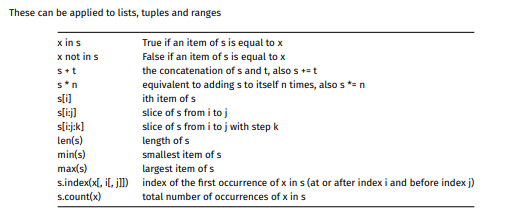
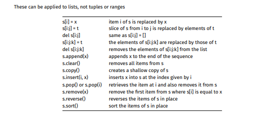
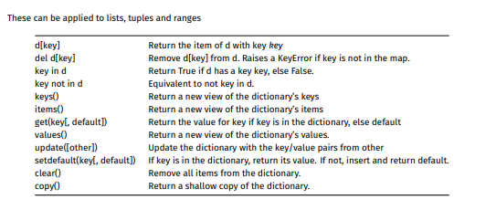

<h1 align="center">Week 7</h1>
<h1>Python Basics</h1>
<h2>Variables</h2>

###

- Python has a strong , dynamic, duck type system
  - Strong: Does not force type conversions meaning, if we do (int + str) it will not work
  - Dynamic: Do not declare types explictly
  - Duck Typing: Does not care what the type is but whether it has certain functionality
- Some types include numeric, sequence types (lists), mapping types (dict)
- You cannot have unintialised variables

```python
# This wont work
x
print(x)

# But this will
y = 1
print(y)
```

- Python declares and initialises the value to the variable at the same type, as it is dynamically typed and otherwise will not know what the variable is

<h2>Comparison Operators</h2>

- `==` equal
- `!=` not equal
- `>` greater than
- `<` less than
- `>=` greater than or equal to
- `<=` less thhan or equal to

<h2>Bitwise Operators </h2>

- `&` and
- `|` or
- `^` xor
- `-` not
- `<<` left shift
- `>>` right shift

<h2>Arithmetic Operators </h2>

- `+` addition
- `-` subtraction
- `*` multiplitcation
- `//` division returning int
- `/` division returning float
- `%` modulus
- `**` exponentitation

<h2>Logical Operators</h2>

- `x || y` : x or y
- `x && y` : x and y
- `!x` : not x

<h2>New Operators</h2>

- `x is y` : Returns **True** if both variables are the same object
- `x is not y` : Returns **True** if bith variables are not the same object
- `x in y` : Returns **True** if a sequence with the specified value is present in the object
- `x not in  y` : Returns **True** if a sequence with the specified value is not present in the object

```python
a = 1
b = 1

w1 = "1"
w2 = str(1)

# False
if w1 is w2:
    print("w1 and w2 are equal")

# True
if a is b:
    print("a and b are equal")

# True
if w1 == w2:
    print("w1 and w2 are equal?")

# These will be the same
print(id(a), id(b))
# These wont
print(id(w1), id(w2))
```

- We can notice that even though they have the same value they are not the same object
- Note its important we want to use `==` if we want to compare the value

<h2>What is True or False</h2>

- `False` is false
- `None` is false
- `numeric zero (0)` is false
- `Empty sequences and strings` are false
- `Everything else` is true

<h2>Control Structures</h2>

```python
### If statements
if boolExpr:
    Statement
elif boolExpr:
    Statement
else:
    Statement

### Loops
while boolExpr:
    Statement

for value in iterator:
    Statement

### Use of range
for v in range(1, 10, 2):
    print(v)

# Prints out 1 3 5 7 9

### Case statements
match var:
    case option1:
        Statement
    case option2:
        Statement
    case _:
        Default Statement

### Terminating
import sys

# Exiting the program
if not true:
    sys.exit(1)

# Sending out an error
if not true:
    raise TypeError(f"Error")

# Assert statement to check if something is true otherwise sends an Error
assert data is not None
```

<h1>Python More</h1>
<h2>Names & Types</h2>

- Python associated types with values -> why we have to initialise all variables
- Python variables can refer to a value of any type
- `Type` function can give us insight into what the value is

<h2>Sequences</h2>

- No arrays in python but has other sequence types being lists, tuples and ranges
- Lists are mutable and act very similar to an array
- Tuples are immutable and store a set amount of data that can be unpacked
- Ranges denote an immutable sequence of numbers

<h2>Useful Operations on Sequences</h2>





<h2>Files</h2>

- Below is a simple example of how to open a file and read / write to it

```python
# Different options depending on what you want to dowith the file
f = open("a.txt", "r")
data = f.read()
print(data)
f.close()

# Note that write goes to EOF, so if we try to read it after writing
# We will not read anything
f = open("b.txt", "w+")
f.write("Orange")
f.seek(0)
data = f.read()
print(data)
f.close()
```

<h2>Exceptions</h2>

- Python has "Try Catch" blocks but its "Try Except"
- It tries to execute the logic otherwise it handles the error case

```python
# x = 1  or x changes the behaviour
try:
  print(x)
except NameError:
  print("Variable x is not defined")
except:
  print("Something else went wrong")
```

<h2>Python Dictionary</h2>

- Similar to hashmaps with key value pairs
- Python dictionaries can have almost any value as the index
- However the index cannot be mutable -> list / dict



<h1>Tutorial Questions</h1>

<!-- Start of Q  -->
<h2>Q1</h2>
<details>
<!-- ==========  -->
<summary>
In shell we have been using the following hashbang:

```
#!/bin/dash
```

How should we modify this hashbang to use it with python?

</summary>

###

- In python we can use the hashbang below:

```
#!/usr/bin/env python3
```

- This will call the python3 interpreter
- It does the calling indirectly by using `env` that will search for the PATH of the python3 interpreter
- Meaning we do not need to know the location of the interpreter
- `env` is also useful for virtual environments
- Common locations are:
  - /bin/python3
  - /usr/bin/python3
  - /usr/local/bin/python3

<!-- End of Q  -->
</details>
<!--  =======  -->

<!-- Start of Q  -->
<h2>Q3</h2>
<details> 
<!-- ==========  -->
<summary>Where can you find python3 documentation?</summary>

###

- Python doesnt have the full documentation in teh `man` pages
- It has an inbuilt `help` function for documentation instead

```sh
$ python3
>>> help(print)

Help on built-in function print in module builtins:

print(...)
print(value, ..., sep=' ', end='\n', file=sys.stdout, flush=False)
```

- Full python documentation can be found https://docs.python.org/3.12/

<!-- End of Q  -->
</details> 
<!--  =======  -->

<!-- Start of Q  -->
<h2>Q4</h2>
<details> 
<!-- ==========  -->
<summary>What is REPL? How to start python REPL?</summary>

###

- Stands for `read-eval-print loop`
- REPL is a way to interact with a programming language
- A terminal is a shell REPL as it:
  - 1. **Reads** the cmd line
  - 2. **Evaluates** the cmd by executing
  - 3. **Prints** the stdout and stderr of the cmd
  - 4. **Loops** waiting for more input
- You can run the python REPL below:

```
$ python3
>>>
```

- You can run the python code line by line

<!-- End of Q  -->
</details> 
<!--  =======  -->

<!-- Start of Q  -->
<h2>Q5</h2>
<details> 
<!-- ==========  -->
<summary>
Write a simple version of the head command in Python, that accepts an optional command line argument in the form -n, where `n` is a number, and displays the first `n` lines from its standard input.
If the `-n` option is not used, then the program simply displays the first ten lines from its standard input.

```sh
# display first ten lines of file2
$ ./head.py < file2
# same as previous command
$ ./head.py -10 < file2
# display first five lines of file2
$ ./head.py -5 < file2
```

</summary>

###

```python
#! /usr/bin/env python3

import sys

n_lines = 10

if len(sys.argv) > 1 and sys.argv[1].startswith('-'):
    arg = sys.argv[1]
    arg = arg[1:]
    n_lines = int(arg)

n = 1
for line in sys.stdin:
    if n > n_lines: break
    sys.stdout.write(line)
    n += 1
```

<!-- End of Q  -->
</details> 
<!--  =======  -->

<!-- Start of Q  -->
<h2>Q6</h2>
<details> 
<!-- ==========  -->
<summary>
Modify the head program from the previous question so that, as well as handling an optional -n argument to specify how many lines, it also handles multiple files on the command line and displays the first n lines from each file, separating them by a line of the form '==> FileName <==='

```sh
# display first ten lines of file1, file2, and file3
$ ./head.py file1 file2 file3
# display first three lines of file1, and file2
$ ./head.py -3 file1 file2
```

</summary>

###

<!-- End of Q  -->
</details> 
<!--  =======  -->

<!-- Start of Q  -->
<h2>Q10</h2>
<details> 
<!-- ==========  -->
<summary>How can we use regular expressions in python?</summary>

###

- Python has a built-in regular expr library being the `re` module
- To use the `re` module we need to import it

```python
# Import the whole library
import re

text = "The sky is blue"
x = re.search(r"blue", text)

# Or import individual functions
from re import search, match, fullmatch

text = "The sky is not blue"
x = search(r"blue", text)
```

- The three functions we import are used the same way

```
search(pattern, string [, flags])
```

- Where `pattern` is the regular expression to search for
- `string` is the string to search in
- `flags` are optional modifiers

<!-- End of Q  -->
</details> 
<!--  =======  -->

<!-- Start of Q  -->
<h2>Q11</h2>
<details> 
<!-- ==========  -->
<summary>What is the difference between search, match, and fullmatch?</summary>

###

- `search` is the most like `grep` which will match anywhere in the string
- `match` will only match at the beginning of the string which is the same as using `search` with the `^` anchor
- `fullmatch` will match both the beginning and end of the string which is the same as using `search` with both `^` and `$` anchors

<!-- End of Q  -->
</details> 
<!--  =======  -->

<!-- Start of Q  -->
<h2>Q12</h2>
<details> 
<!-- ==========  -->
<summary>How are Python's regular expressions different from grep?</summary>

###

- When `grep` finds a match, it prints the line where the match was found, but python returns a `match` object
- match objects have some attributes:
  - `Match.span()` - starting & ending index of the match
  - `Match.re.pattern` - regex pattern used
  - `Match.string` - the original string
  - `Match.group(0)` - the match
  - `Match.group(N)` - capture groups
- `grep` finds all non-overlapping matches, whilst python finds the first match
- `grep` works line by line while python works on the entire string
- `grep` has options such as `-i` but python has flags that do the same thing

<!-- End of Q  -->
</details> 
<!--  =======  -->
